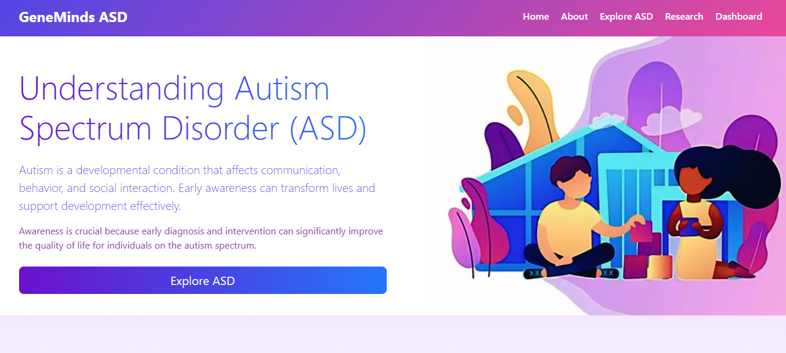
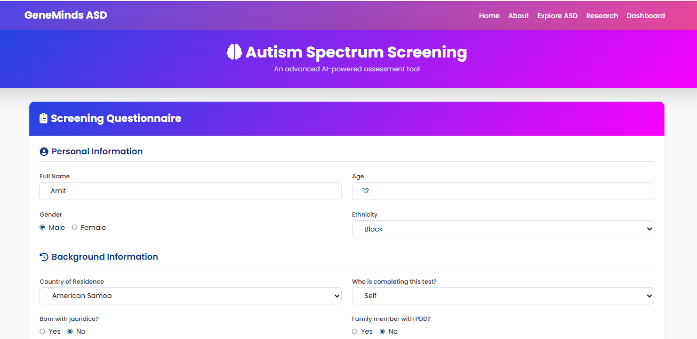
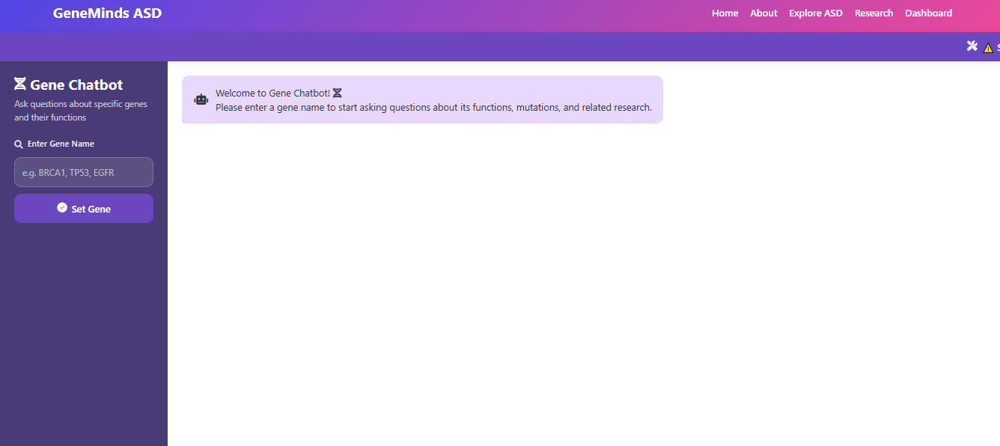
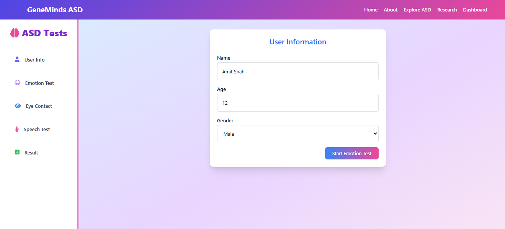
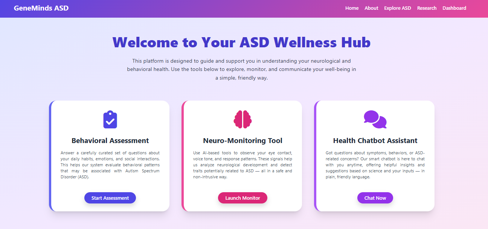
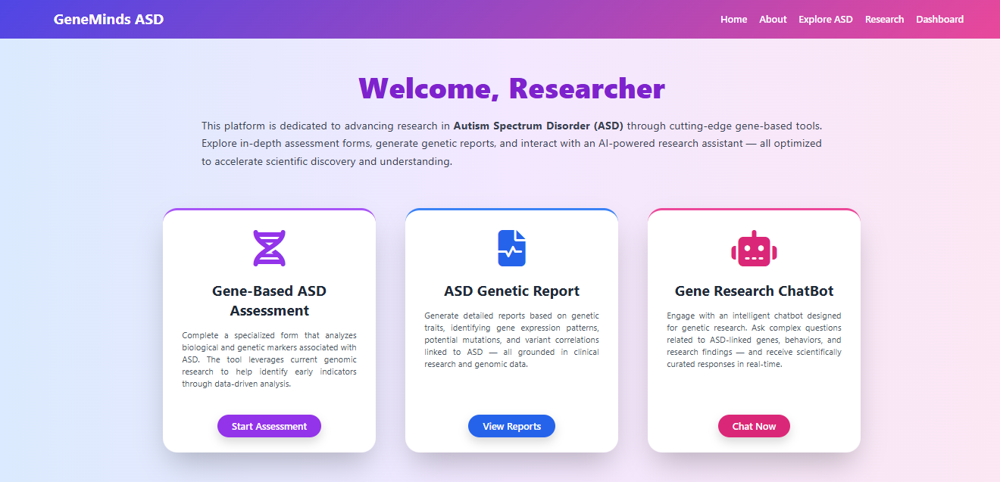
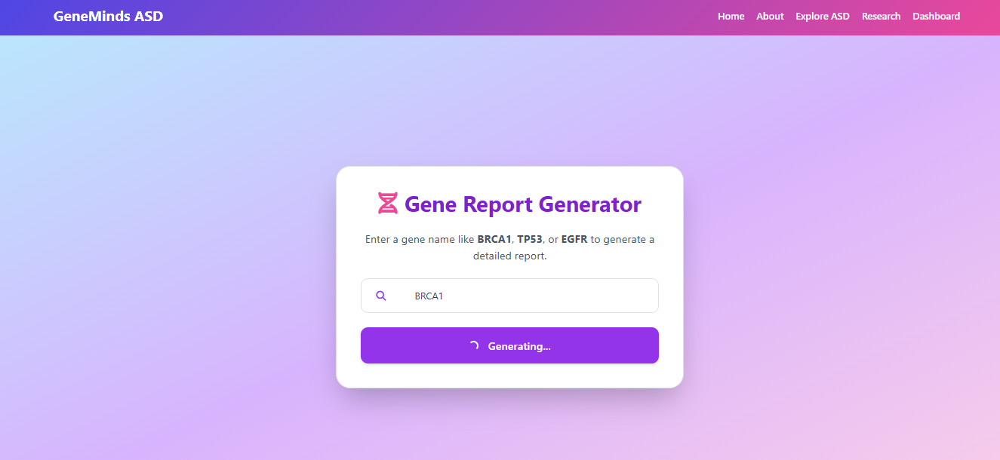
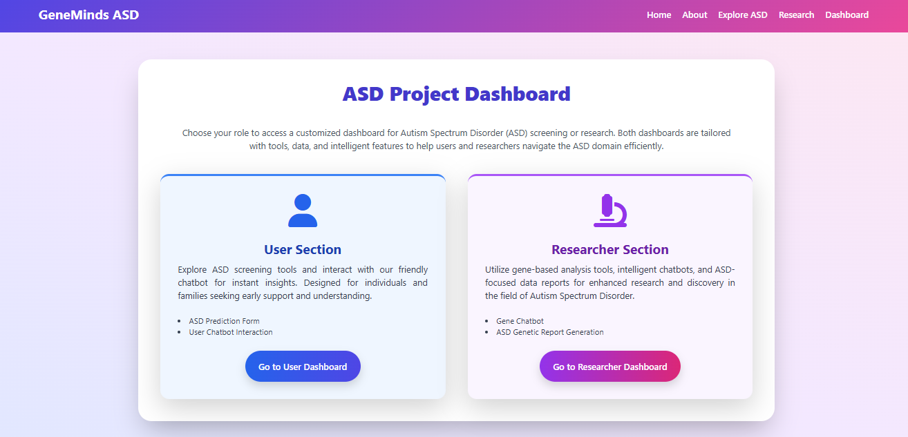
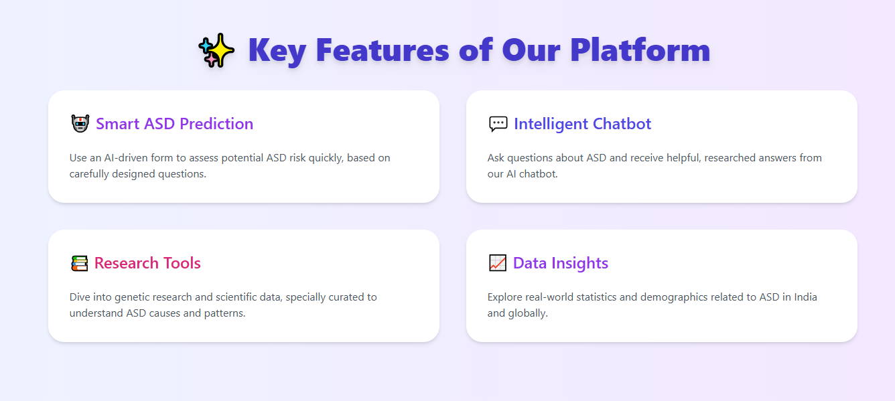

# GeneMinds ASD - Autism Spectrum Disorder Detection & Research Platform

**Revolutionizing Early ASD Detection Through AI and Genetic Research**

## 🌟 Overview

GeneMinds ASD is an innovative platform designed to support early detection and research of Autism Spectrum Disorder (ASD). Our comprehensive solution combines technology with compassionate care to make ASD screening more accessible and meaningful.

## 🎯 Problem Statement

### The Critical Need for Early ASD Detection

Autism Spectrum Disorder presents significant challenges in early identification and intervention. Current diagnostic processes often face several barriers that delay crucial early support for individuals and families.

### Key Challenges in ASD Detection

- **🕒 Late Identification**: Many individuals receive diagnoses later than optimal for early intervention
- **🌍 Geographical Barriers**: Limited access to specialized assessment in underserved areas
- **📊 Complex Diagnosis**: Multifaceted evaluation requirements across behavioral, communication, and social domains
- **🔬 Research Gaps**: Need for more comprehensive data integration from multiple assessment modalities

## 💡 Our Solution

GeneMinds ASD addresses these challenges through a unified platform that serves multiple stakeholders:

### 👨‍👩‍👧‍👦 For Families and Individuals
- Accessible screening tools
- Educational resources
- Progress tracking

### 🏥 For Healthcare Providers
- Assessment support tools
- Data-driven insights
- Documentation assistance

### 🔬 For Researchers
- Genetic pattern analysis
- Anonymized data aggregation
- Research collaboration tools

## 🛠️ Technology Stack

### Core Platform Technologies
- **Frontend**: HTML5, CSS3, JavaScript, Responsive Design
- **Backend**: Python with Flask Framework
- **Database**: Secure Data Storage
- **Deployment**: Web-based Platform

### Advanced AI and Research Technologies

#### 🤖 Machine Learning & AI
- Predictive modeling for risk assessment
- Pattern recognition algorithms
- Data analysis tools

#### 👁️ Computer Vision Integration
- Eye contact and gaze pattern analysis
- Behavioral observation support
- Visual engagement metrics

#### 🎤 Voice and Speech Analysis
- Natural Language Processing for communication patterns
- Vocal characteristic assessment
- Speech rhythm and tone analysis

#### 💬 Intelligent Chat System
- Research-backed information delivery
- Context-aware responses
- Educational support

## 📊 Platform Features

### 1. Comprehensive ASD Assessment

**Multi-dimensional Evaluation:**
- Behavioral observation tracking
- Communication pattern analysis
- Social interaction assessment
- Developmental milestone review

### 2. Dual Dashboard System

**User Dashboard:**

- Personal assessment history
- Resource access
- Progress monitoring

**Researcher Dashboard:**

- Advanced analytics
- Research tools
- Data visualization

### 3. Genetic Research Integration

**Research Features:**
- Genetic marker analysis
- Family pattern tracking
- Research data management
- Scientific collaboration support

### 4. Central Dashboard Hub

**Unified Access to:**
- Assessment tools
- Research modules
- Educational content
- Support resources

## 🔬 Research Foundation

### Evidence-Based Approach
GeneMinds ASD integrates established research methodologies with innovative technological approaches:

- **Behavioral Analysis**: Incorporating recognized assessment frameworks
- **Genetic Research**: Supporting investigation into ASD-related patterns
- **Multi-modal Assessment**: Combining various data sources for comprehensive evaluation

### Technology Integration
Our platform brings together multiple technological approaches:

- **Computer Vision**: For visual behavior analysis
- **Natural Language Processing**: For communication pattern assessment
- **Machine Learning**: For pattern recognition and prediction
- **Data Analytics**: For research insights and trend identification

## 🚀 Getting Started

### Access the Platform
GeneMinds ASD is available as a web-based platform accessible through modern browsers.

### Platform Navigation
1. **Home**: Overview and introduction to ASD awareness
2. **Assessment**: Comprehensive evaluation tools
3. **Dashboard**: Personalized user interface
4. **Research**: Advanced tools for investigators
5. **Resources**: Educational materials and support information

## 🌍 Our Mission

GeneMinds ASD is committed to:
- **Early Detection Support**: Providing accessible screening tools
- **Research Advancement**: Supporting scientific investigation into ASD
- **Education and Awareness**: Spreading understanding about autism spectrum disorder
- **Family Support**: Offering resources and guidance for families and caregivers

## 🤝 Collaboration Opportunities

We welcome collaboration with:
- Healthcare professionals
- Research institutions
- Educational organizations
- Community support groups
- Technology developers

  
---

**GeneMinds ASD - Supporting Early Detection, Advancing Research, Building Understanding**

*Together, we're creating a more informed and supportive world for individuals with ASD*

---

